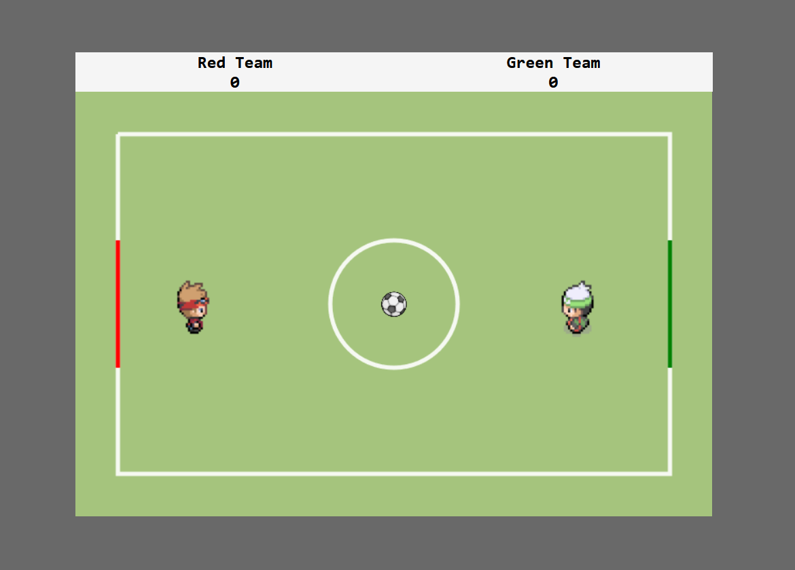

# Football game
A football game written in vanilla javascript.

## Description
The game is a two player/team football game. Objective is to run into the ball with your player to "kick" it to end up in your opponents goal. A score is then given to your player and the ball respawns in the middle of the field.

### Development
- The game is rendered to a HTML-canvas element.
- Vite's provided dev server is used to run the application.
- ESLint is used for consistent formatting. 
- The code is written in a MVC-pattern to embrace separations of concerns and low coupling/high cohesion.

## Getting started
Clone the repository or [fork](https://docs.github.com/en/get-started/quickstart/fork-a-repo) it for your own project!

### Installing dependencies (vite)
``javascript
  npm install
``

### Building
``javascript
  npm run build
``

### Running the application
``javascript
  npm run vite
``

## Use the project
Red team player: moves with arrowkeys.
Green team player: moves with 'WASD'-keys.

## Contribute?
See DEVELOPER.md

## License 
The code in this repository is licensed under the [MIT-license](./LICENSE).

